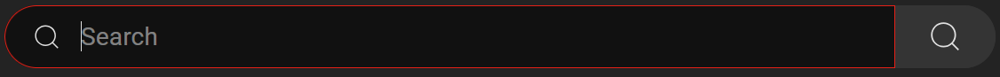

# YouTube-AFS
Userscript to auto focus the search bar in YouTube as soon as the page is opened, so you can start typing your search query immediately.

For use with Tampermonkey or Greasemonkey.

Screenshot
------------

Installation
------------

First, install a plugin that enables UserScript. There are several plugins for each web browser:

- Chrome or Firefox: [Tampermonkey](https://www.tampermonkey.net/)
- Firefox: [Greasemonkey](https://addons.mozilla.org/en-US/firefox/addon/greasemonkey/)

Then, [click here to install](https://gist.github.com/HaroldPetersInskipp/5129292f3750d99735c2a8b352a5651c/raw/youtube-afs.user.js).
